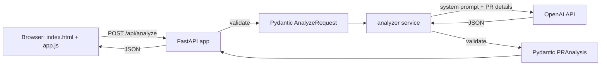

# PR Risk Agent

**Know the risk before you merge.**

PR Risk Agent is a focused AI agent that reviews a pull request — a title, description, and
diff — the way a cautious senior engineer would before signing off on a merge. It returns a
structured risk report: overall risk level, merge recommendation, categorized findings, missing
tests, deployment/rollback considerations, and an honest confidence score.

> **This tool provides automated, AI-generated suggestions. It does not replace human code
> review, testing, or engineering judgment.**

## Why this is useful

Code review is expensive and easy to rush right before a deploy. PR Risk Agent gives a fast,
structured second opinion focused on the categories reviewers most often miss under time
pressure — security (auth, SQL injection, secrets), correctness, reliability, and rollback
safety — without pretending to replace a human reviewer.

## Features

- Single-page UI: paste a PR title, description, diff, and optional repo context, click **Analyze PR**.
- Structured, validated JSON output (Pydantic-enforced) — never raw, unstructured model text.
- Findings are categorized (correctness / security / performance / reliability / maintainability)
  and rated by severity (info → critical), with evidence and suggested fixes.
- Missing test suggestions, deployment considerations, and a rollback plan.
- Honest confidence scoring — the agent is instructed to reflect how much context it actually has.
- Client- and server-side validation (diff required, 50,000-character cap).
- Friendly loading and error states; a one-click realistic "risky" sample PR to try instantly.
- No database, no auth, no tracking — a single FastAPI service serving both API and frontend.

## Architecture



- **`app/main.py`** — FastAPI app: serves the frontend (`GET /`), a health check (`GET /health`),
  and the analysis endpoint (`POST /api/analyze`). Handles validation and error responses.
- **`app/models.py`** — Pydantic request/response schemas, including the structured
  `PRAnalysis` output contract.
- **`app/services/analyzer.py`** — All LLM integration: the system prompt, the OpenAI call, JSON
  extraction, and schema validation, isolated so the model/provider can change independently of
  the API layer.
- **`app/templates/index.html`**, **`app/static/`** — Vanilla HTML/CSS/JS frontend, no build step,
  no framework.
- **`tests/test_api.py`** — Pytest suite with the analyzer mocked (no real API calls).

## Agent workflow

1. User submits a PR title, description, diff, and optional context.
2. FastAPI validates the request (diff required, non-empty, ≤ 50,000 characters).
3. The analyzer service sends a system prompt plus the PR details to the configured OpenAI model,
   requesting JSON-only output.
4. The response is parsed and validated against the `PRAnalysis` Pydantic schema. If parsing or
   validation fails, one controlled retry is attempted; a second failure returns a clean error to
   the client (no raw model output or stack traces are ever exposed).
5. The frontend renders the validated report: risk badge, merge recommendation, confidence bar,
   categorized findings, missing tests, deployment/rollback notes, and positive observations.

The system prompt explicitly instructs the model to reason only from the evidence provided, avoid
inventing repository details, distinguish confirmed issues from speculative risks, and pay close
attention to auth, input validation, database changes, concurrency, secret exposure, and
destructive operations.

## Local setup

Requires Python 3.11+.

```bash
python3 -m venv .venv
source .venv/bin/activate
pip install -r requirements.txt

cp .env.example .env
# edit .env and set a real OPENAI_API_KEY

uvicorn app.main:app --reload --port 8080
```

Open http://localhost:8080.

## Environment variables

| Variable         | Required | Default          | Description                                  |
|------------------|----------|------------------|-----------------------------------------------|
| `OPENAI_API_KEY` | Yes      | —                | API key used for all model calls (backend only). |
| `OPENAI_MODEL`   | No       | `gpt-4.1-mini`   | Model used for analysis.                      |
| `PORT`           | No       | `8080`           | Port the server listens on.                   |

Never commit a real API key. `.env.example` contains placeholders only.

## Docker

Build and run locally:

```bash
docker build -t pr-risk-agent .
docker run --rm -p 8080:8080 \
  -e OPENAI_API_KEY="your-key" \
  pr-risk-agent
```

Open http://localhost:8080.

The image is based on `python:3.11-slim`, installs only the packages in `requirements.txt`, and
starts Uvicorn bound to `0.0.0.0` on `$PORT` (default `8080`).

## Maritime deployment

These commands assume the repository has been pushed to a public GitHub repo. **Deployment has
not been performed as part of this build** — the commands below are provided for reference and
require explicit approval before running.

```bash
npm install -g maritime-cli
maritime login
maritime create pr-risk-agent \
  --repo https://github.com/YOUR_GITHUB_USERNAME/PR-Risk-Agent \
  --public \
  --port 8080
maritime env set pr-risk-agent OPENAI_API_KEY=YOUR_KEY
maritime env set pr-risk-agent OPENAI_MODEL=gpt-4.1-mini --no-secret
maritime env reload pr-risk-agent
```

## Example input

Click **Load sample (risky) PR** in the UI to populate the form with a realistic Python/FastAPI
diff that:

- Builds a SQL query with untrusted string interpolation.
- Swallows an exception (`except Exception: pass`).
- Removes an existing authorization check (`Depends(require_admin)`).
- Adds a destructive, unauthenticated bulk-delete database operation.
- Ships with no corresponding tests.

The sample is only used to populate the form — it is never auto-submitted.

## Known limitations

- Analysis quality depends entirely on the underlying model and the context provided; a small
  diff with no repository context will (and should) produce a lower confidence score.
- No GitHub integration: diffs must be pasted manually. This is intentional — see below.
- No persistence: submitted diffs and results are not stored anywhere.
- Single controlled retry on malformed model output; persistent failures surface as a clean error
  rather than being retried indefinitely.
- Not a substitute for CI, static analysis tools, or human review.

## Future improvements

- Optional GitHub PR URL input (read-only fetch of a diff via the GitHub API) as an alternative to pasting.
- Side-by-side diff viewer with inline finding annotations.
- Exportable report (Markdown/PDF) for pasting into a PR description.
- Per-finding "acknowledge/dismiss" state for iterative review sessions.

## Scope note

This project intentionally avoids GitHub OAuth, direct repository access, a database, and
authentication to keep the demo narrowly scoped, safe to deploy publicly, and easy to evaluate
end-to-end. All model calls happen server-side; no API key is ever exposed to the browser.

## Disclaimer

PR Risk Agent produces automated, AI-generated suggestions based only on the text provided to it.
It does not execute code, does not access real repositories, and does not replace human code
review, testing, or judgment before merging or deploying changes.
